  

## 🚀 Active This Week

| Repo | Commits | AI Sessions |
|------|---------|-------------|
| [**zerg**](https://github.com/cipher982/zerg) | 43 | 21 |
| [**stopsign_ai**](https://github.com/cipher982/stopsign_ai) | 20 | 18 |
| [**ai-tools-website**](https://github.com/cipher982/ai-tools-website) | 23 | 14 |
| [**this-wine-does-not-exist**](https://github.com/cipher982/this-wine-does-not-exist) | 22 | 9 |
| [**drose_io**](https://github.com/cipher982/drose_io) | 24 | 2 |

## 💡 About

I'm a full-stack developer building AI-powered applications. This profile showcases my **AI-native development workflow** - combining traditional git commits with AI pair programming sessions from Claude Code and OpenAI Codex.

**What makes this unique?** Rather than just showing finished work (commits), this dashboard reveals the actual building process through:
- Real-time AI collaboration metrics
- Parallel development across multiple projects
- Deep problem-solving sessions (avg 370 turns/session)

## 🛠️ Current Stack

  

## 📊 How This Works

This README updates automatically every 6 hours via GitHub Actions. Data sources:
- **Git activity**: Parsed from local repositories via `git log`
- **Claude sessions**: Parsed from `~/.claude/projects/`
- **Codex sessions**: Parsed from `~/.codex/sessions/`

All metrics are computed locally and aggregated into a single JSON file, then visualized in the hero SVG above.

---

🔍 Detailed Stats (Last 30 Days)

- **Commits**: 430
- **Languages**: Python (346), TypeScript (82), Shell (2)
- **AI Sessions**: Claude 191 · Codex 198
- **Total Turns**: 100.2k

*Last updated: 2025-10-02 21:08 UTC*
