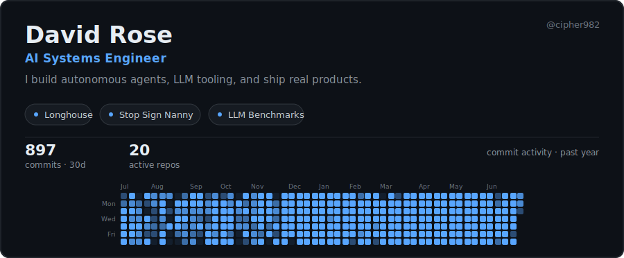

  

I build AI-powered applications and infrastructure. Most of my work involves autonomous agents, LLM tooling, and shipping real products — from computer vision systems to full-stack web apps. The dashboard above tracks my AI pair programming workflow in real time.

---

## Projects

### AI & Agents

| Project | Description |
|---------|-------------|
| 🪵 [**Longhouse**](https://longhouse.ai) | Centralized platform for managing AI agent sessions, insights, memory, and orchestration |
| ⚡ [**LLM Benchmarks**](https://llm-benchmarks.com) | Benchmarking LLM inference speeds across providers — 13 stars |
| 🐣 [**Hatch**](https://github.com/cipher982/zerg/tree/main/packages/hatch-agent) | CLI tool for spawning headless AI agents (Claude, Codex, Gemini) |
| 🔧 [**MCP Tools**](https://github.com/cipher982/mcp-tools) | Lightweight MCP server facades for Claude Code — 90%+ token reduction |
| 🎁 [**Code Wrapped**](https://github.com/cipher982/code-wrapped) | Spotify Wrapped for your AI pair programming year |
| 📜 [**Agentlog**](https://github.com/cipher982/agentlog) | Canonical parser for AI agent session logs (Claude, Codex, Gemini, Cursor) |

### Apps & Sites

| Project | Description |
|---------|-------------|
| 🛑 [**Stop Sign Nanny**](https://crestwoodstopsign.com) | AI + IP camera system that tracks and scores vehicle behavior at intersections |
| 🌅 [**HDR Pop**](https://github.com/cipher982/hdr) | Transform standard photos into HDR using AI-powered gain map generation |
| 🏀 [**March Madness LLM**](https://marchmadness.drose.io) | NCAA bracket simulator with AI-powered decisions and a React frontend |
| 🍷 [**This Wine Does Not Exist**](https://thiswinedoesnotexist.com) | Generating fake wines with GPT-2 + StyleGAN |
| 🌊 [**FloodMap USA**](https://drose.io/floodmap) | Interactive flood risk mapping with elevation data |
| 🤖 [**AI Tools Directory**](https://aitools.drose.io) | AI agents that discover, catalog, and organize emerging AI tools |
| 🖥️ [**Pixel Pilot**](https://github.com/cipher982/pixel-pilot) | AI agent for completing computer tasks via screen control |

### Earlier Work

| Project | Description |
|---------|-------------|
| 🚗 [**MPC Vehicle Controller**](https://github.com/cipher982/MPC-vehicle-controller) | Model predictive control + computer vision for autonomous vehicle steering — 21 stars |
| 🦾 [**Robotic Control with DRL**](https://github.com/cipher982/Robotic-Control-in-Unity-with-DRL) | Deep reinforcement learning for robotic control in Unity |
| 🎯 [**PID Control**](https://github.com/cipher982/PID-Control) | PID vehicle controller for autonomous driving |
| 🛣️ [**Lane Tracking**](https://github.com/cipher982/HiFi-Lane-Tracking) | Image processing pipeline for autonomous lane detection |

---

## Active This Week

| Repo | Commits | AI Sessions |
|------|---------|-------------|
| **longhouse** | 293 | 237 |
| **life-hub** | 19 | 11 |
| **llm-vision-explainer** | 0 | 18 |
| **deployment-dashboard** | 0 | 15 |
| **zmp-provisioning-factory** | 0 | 13 |

## How I Build

The dashboard at the top updates automatically every 6 hours. It tracks my AI-native development workflow — combining traditional git commits with AI pair programming sessions across multiple tools.

- **4 AI coding agents** running in parallel: Claude Code, OpenAI Codex, Gemini, Cursor
- **Avg 37 turns/session** — deep problem-solving, not quick prompts
- All metrics computed locally and via the [Longhouse](https://longhouse.ai) API

  

Data sources

- **Git activity**: GitHub API + local `git log`
- **Claude sessions**: `~/.claude/projects/`
- **Codex sessions**: `~/.codex/sessions/`
- **Cursor sessions**: `state.vscdb` (SQLite)
- **Gemini sessions**: `~/.gemini/tmp/*/logs.json`

---

Detailed Stats (Last 30 Days)

- **Commits**: 884
- **Languages**: Python (725), Shell (88), TypeScript (37), JavaScript (5)
- **AI Sessions**: Claude 587 · Codex 598 · Cursor 0 · Gemini 5
- **Total Turns**: 24.3k

*Last updated: 2026-03-29 06:20 UTC*
