  

## 🚀 Active This Week

{{SHIPPING_TABLE}}

## 💡 About

I'm a full-stack developer building AI-powered applications. This profile showcases my **AI-native development workflow** - combining traditional git commits with AI pair programming sessions from Claude Code, OpenAI Codex, Cursor, and Gemini.

**What makes this unique?** Rather than just showing finished work (commits), this dashboard reveals the actual building process through:
- Real-time AI collaboration metrics
- Parallel development across multiple projects
- Vibe coding sessions (avg {{AVG_TURNS}} turns/session)
- And it was just fun to build! 😊

## 🛠️ Current Stack

{{LANGUAGE_BADGES}}

## 📊 How This Works

This README updates automatically every 6 hours via GitHub Actions. Data sources:
- **Git activity**: Parsed from local repositories via `git log`
- **Claude sessions**: Parsed from `~/.claude/projects/`
- **Codex sessions**: Parsed from `~/.codex/sessions/`
- **Cursor sessions**: Parsed from `state.vscdb` (SQLite)
- **Gemini sessions**: Parsed from `~/.gemini/tmp/*/logs.json`

All metrics are computed locally and aggregated into a single JSON file, then visualized in the hero SVG above.

---

🔠Detailed Stats (Last 30 Days)

- **Commits**: {{COMMITS_30D}}
- **Languages**: {{LANGUAGES_30D}}
- **AI Sessions**: Claude {{CLAUDE_30D}} · Codex {{CODEX_30D}} · Cursor {{CURSOR_30D}} · Gemini {{GEMINI_30D}}
- **Total Turns**: {{TURNS_30D}}

*Last updated: {{UPDATED_AT}}*
